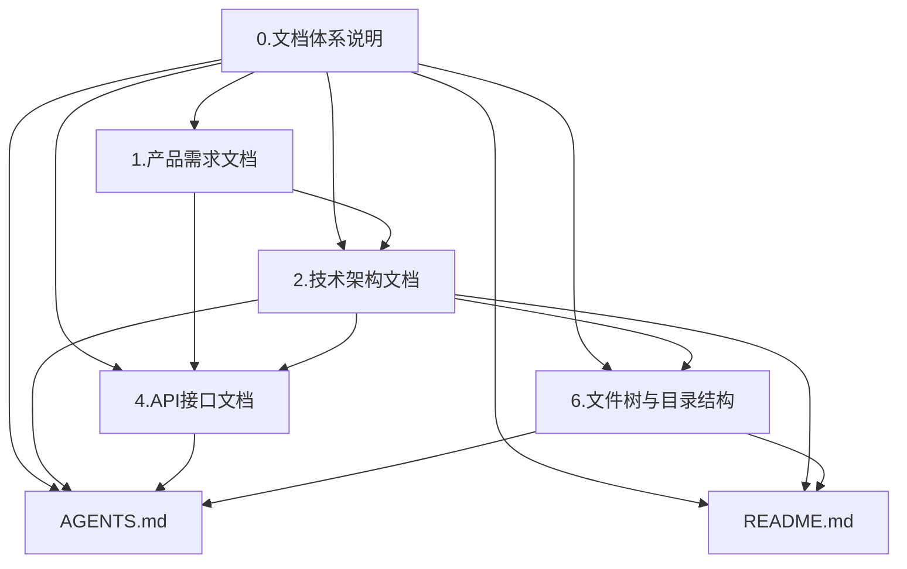

# 0.文档体系说明

> 本文件是 `D:\桌面\zhishi-web` 的文档体系元规则。它只定义长期文档清单、职责边界、联动规则和 AI 协作入口，不承载具体业务、架构字段或阶段计划。

## 1. 文档体系原则

### 1.1 长期文档只记录稳定真相

长期文档记录会被反复引用、需要长期维护的内容，例如产品需求、系统架构、接口契约、目录结构、启动命令和 AI 协作规则。

不进入长期文档的内容包括单次任务计划、阶段路线、临时排期、PR 列表、未确认实现猜测和短期讨论过程。

### 1.2 每类信息只保留一个主要真相源

同一类信息只维护一个主要位置：

| 信息类型 | 真相源 |
| --- | --- |
| 文档体系和联动规则 | `docs/0.文档体系说明.md` |
| 产品目标、用户场景、商业模式、功能分层 | `docs/1.产品需求文档.md` |
| 架构边界、模块依赖、技术选型 | `docs/2.技术架构文档.md` |
| API、DTO、错误码、事件和状态对象 | `docs/4.API接口文档.md` |
| 文件树、目录职责、命名规则、文件数量 | `docs/6.文件树与目录结构.md` |
| 人类开发者入口、安装和命令 | `README.md` |
| AI / Agent 执行入口 | `AGENTS.md` |

其他文档可以作为历史记录或临时审计材料，但不能覆盖以上真相源。

### 1.3 文档数量从简

默认长期文档只保留本文件列出的 7 个入口：`0`、`1`、`2`、`4`、`6`、`README.md`、`AGENTS.md`。

默认不创建：

- `3.技术路线文档.md`
- `7.项目分工文档.md`
- `8.任务分解与实现步骤.md`
- `9.数据模型文档.md`
- `CLAUDE.md`

其中 `9.数据模型文档.md` 的职责并入 `4.API接口文档.md`。AI 协作入口只使用 `AGENTS.md`，不再额外生成 `CLAUDE.md`。

## 2. 默认文档清单

| 类型 | 文件 | 状态 | 核心职责 |
| --- | --- | --- | --- |
| 元说明 | `docs/0.文档体系说明.md` | 必须 | 定义文档体系、联动规则、AI 协作入口 |
| 产品需求 | `docs/1.产品需求文档.md` | 必须 | 描述产品定位、用户场景、模式分层、业务边界 |
| 技术架构 | `docs/2.技术架构文档.md` | 必须 | 描述技术栈、模块边界、依赖方向、当前实现与目标差异 |
| 接口与数据契约 | `docs/4.API接口文档.md` | 必须 | 描述 API、DTO、错误码、枚举、状态对象、事件载荷 |
| 文件结构 | `docs/6.文件树与目录结构.md` | 必须 | 描述目录职责、文件命名、文件归属、文件数量 |
| 人类入口 | `README.md` | 必须 | 面向开发者说明项目是什么、如何启动、如何验证、去哪看文档 |
| AI 入口 | `AGENTS.md` | 必须 | 面向 AI / Agent 说明读文档顺序、工作规则、验证和 Git 边界 |

## 3. 文档职责边界

### 3.1 `docs/0.文档体系说明.md`

负责回答：

- 项目长期文档有哪些。
- 每份文档分别负责什么。
- 文档之间如何联动。
- 哪些文档默认不创建。
- AI 入口采用什么文件。

不负责回答：

- 产品具体怎么设计。
- 系统具体怎么实现。
- API 字段是什么。
- 目录里每个文件是什么。

实操规范要点：

- 只写文档体系和协作规则。
- 修改文档清单、命名、职责或 AI 入口时，先改本文件，再同步下游文档。
- 下游文档不得自行声明新的强制文档或第二套编号规则。

反模式：

- 在本文件写具体页面实现步骤。
- 在本文件写 API 字段表。
- 为了完整感恢复 `CLAUDE.md`、`3`、`8`、`9` 等非默认文档。

强制维护触发条件：

- 长期文档清单、命名、职责、联动规则发生变化。
- AI 入口文件发生变化。
- 新增或移除默认不创建的文档类型。

### 3.2 `docs/1.产品需求文档.md`

负责回答：

- 知序面向谁。
- 免费、知识追踪、推理等产品层级分别提供什么价值。
- 个人端、教培机构、职业培训、学校、县域公益等场景有什么差异。
- 哪些业务边界已经确认。

不负责回答：

- 前端模块如何拆分。
- API 请求体和响应体。
- 文件应该放哪里。
- 单次开发任务怎么排期。

实操规范要点：

- 只写用户可感知价值、业务规则、场景边界和模式分层。
- 来源材料有 OCR 误差时，只沉淀明确出现的规则，不自由补规则。
- 技术名词如 `LEKT`、`LVR`、`Dynamic-e`、`CABR` 保持原文。

反模式：

- 把 React、Vite、API、目录结构写进产品需求。
- 把临时补齐清单、任务优先级当成长期产品规则。
- 把未确认猜测写成确定规则。

强制维护触发条件：

- 产品模式、用户场景、商业模式、核心流程、隐私边界变化。
- 上传源材料中已有业务规则被确认修订。
- 新增用户端或机构端稳定场景。

### 3.3 `docs/2.技术架构文档.md`

负责回答：

- 当前系统由哪些模块组成。
- 技术栈是什么。
- 模块如何依赖。
- 数据、状态、API、UI、路由分别归属哪里。
- 当前实现和目标设计有什么差异。

不负责回答：

- 每个接口的完整字段。
- 每个目录的完整文件清单。
- 单次任务计划。

实操规范要点：

- 固定使用“入口层、路由层、鉴权层、API 层、数据层、页面层、组件层、样式层”的口径。
- 当前实现和目标设计分开写。
- 模块依赖尽量用图或表表达。

反模式：

- 在架构文档维护完整 API 字段。
- 在架构文档维护完整文件树。
- 完成某个任务后就更新架构文档，但模块边界并未变化。

强制维护触发条件：

- 模块组成、依赖方向、技术选型、状态归属、架构红线变化。
- 当前实现与目标设计的差异发生稳定变化。

### 3.4 `docs/4.API接口文档.md`

负责回答：

- API 路径、方法、鉴权、请求体、响应体。
- DTO、枚举、错误码、状态对象。
- 前端调用方和后端能力边界。
- API 实现状态是已接入、预留还是待后端补齐。

不负责回答：

- 为什么产品要这样设计。
- 为什么模块这样拆。
- 文件放在哪个目录。

实操规范要点：

- 新接口先写本文档，再写 `src/lib/api`。
- 字段含义只在本文档定义一次，代码类型保持对齐。
- 后端真实 OpenAPI 与本文不一致时，必须显式标注差异。

反模式：

- 页面里直接写裸 `fetch`。
- 在多个章节重复定义同一枚举。
- 删除测试来掩盖 API 契约不一致。

强制维护触发条件：

- 新增、删除、修改接口路径、方法、鉴权、请求体、响应体。
- DTO、枚举、错误码、SSE 事件、状态对象变化。
- 前端 API 封装与后端契约发生差异。

### 3.5 `docs/6.文件树与目录结构.md`

负责回答：

- 当前重要目录有哪些。
- 每个目录负责什么。
- 新文件应该放在哪里。
- 文件命名规则是什么。
- 当前文件数量如何统计。
- 历史目录、生成目录、临时目录如何处理。

不负责回答：

- 模块设计原因。
- API 字段。
- 产品业务规则。

实操规范要点：

- 维护“目录 -> 职责 -> 新文件归属”。
- 文件数量必须说明统计口径。
- 历史、生成、渲染、依赖目录要明确不作为业务源码入口。

反模式：

- 只列路径不写职责。
- 把临时产物当成长期源码目录。
- 目录变化后只改代码不改本文档。

强制维护触发条件：

- 任意文件被创建、修改、删除、移动或重命名。
- 顶级目录或重要子目录新增、删除、改名。
- 文件归属规则或命名规则变化。
- 文件数量统计口径变化。

### 3.6 `README.md`

负责回答：

- 项目是什么。
- 如何安装、启动、构建、测试。
- 新开发者先看哪些文档。

不负责回答：

- 完整架构设计。
- 完整 API 字段。
- 完整 AI 操作规则。

强制维护触发条件：

- 项目定位、启动命令、验证命令、文档入口变化。

### 3.7 `AGENTS.md`

负责回答：

- AI 进入仓库后先读什么。
- 修改前如何确认范围。
- 架构、API、文件放置、验证和 Git 的底线是什么。
- 本项目有哪些易错点。

不负责回答：

- 完整产品需求。
- 完整 API 字段。
- 完整目录文件清单。

强制维护触发条件：

- AI 入口规则变化。
- 新增需要 AI 反复遵守的项目特有规则。
- 验证、Git、文档同步约定变化。

## 4. 文档依赖关系



## 5. 文档创建与维护顺序

默认创建顺序：

```text
0.文档体系说明
↓
1.产品需求文档
↓
2.技术架构文档
↓
4.API接口文档
↓
6.文件树与目录结构
↓
README.md
↓
AGENTS.md
```

修改顺序：

| 修改内容 | 先读 | 必要时回写 |
| --- | --- | --- |
| 产品模式、业务规则、用户场景 | `docs/1.产品需求文档.md` | `docs/1.产品需求文档.md`，必要时 `docs/2.技术架构文档.md` / `docs/4.API接口文档.md` |
| 模块边界、状态归属、依赖方向 | `docs/2.技术架构文档.md` | `docs/2.技术架构文档.md`，必要时 `docs/6.文件树与目录结构.md` |
| API、DTO、错误码、事件 | `docs/4.API接口文档.md` | `docs/4.API接口文档.md` |
| 创建、修改、删除、移动、重命名任何文件 | `docs/6.文件树与目录结构.md` | `docs/6.文件树与目录结构.md` |
| 启动、测试、构建命令 | `README.md`、`package.json` | `README.md`、`AGENTS.md` |
| AI 协作规则 | `docs/0.文档体系说明.md`、`AGENTS.md` | `docs/0.文档体系说明.md`、`AGENTS.md` |

## 6. 文档质量检查清单

创建或重写文档体系后检查：

- [ ] 长期文档是否只包含 `0`、`1`、`2`、`4`、`6`、`README.md`、`AGENTS.md`。
- [ ] 是否没有创建 `CLAUDE.md`。
- [ ] 是否没有恢复 `3`、`7`、`8`、`9`。
- [ ] `1` 号文档是否命名为 `1.产品需求文档.md`。
- [ ] `4` 号文档是否承接数据契约职责。
- [ ] `6` 号文档是否说明文件数量统计口径。
- [ ] `README.md` 是否面向人类开发者。
- [ ] `AGENTS.md` 是否是唯一 AI 入口。
- [ ] 是否没有重复维护同一规则。
- [ ] 是否没有虚构命令。
- [ ] 是否没有未收口占位符。

## 7. 快速记忆

默认保留：

```text
0 文档体系说明
1 产品需求文档
2 技术架构文档
4 API接口文档
6 文件树与目录结构
README
AGENTS
```

默认不创建：

```text
CLAUDE
3 技术路线文档
7 项目分工文档
8 任务分解与实现步骤
9 数据模型文档
```

核心分工：

```text
0 管文档体系
1 管产品需求
2 管技术架构
4 管 API 和数据契约
6 管文件树和文件数量
README 管人类入口
AGENTS 管 AI 执行入口
```
