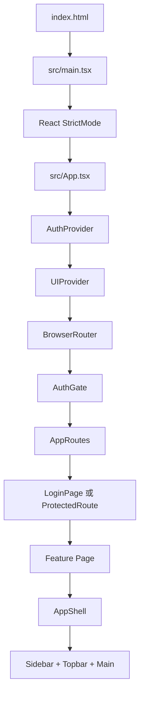
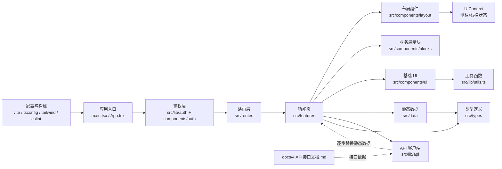
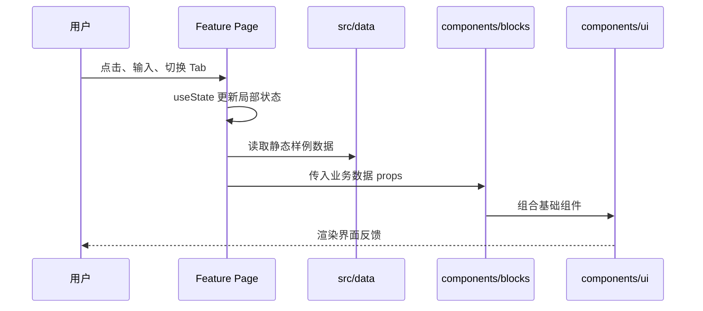
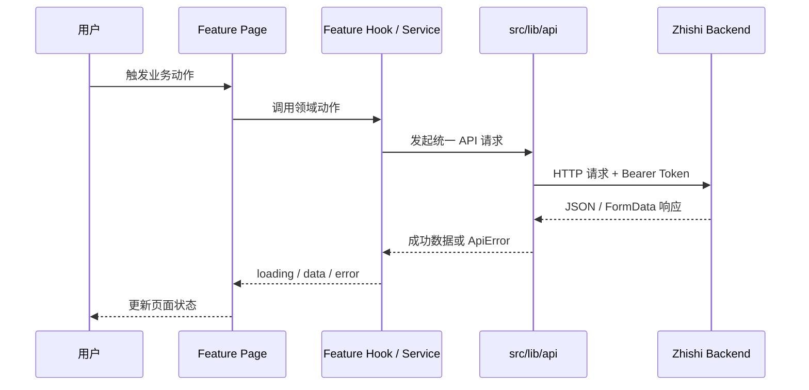

# 知序 Web 端技术架构文档

> 适用仓库：`D:\桌面\zhishi-web`
>
> 当前版本：基于 2026-06-25 本地代码结构整理
>
> 文档定位：说明当前前端应用的真实架构、模块边界、数据流、页面协作方式、扩展约定与已知差距。本文不替代接口文档；后端接口细节以 `docs/4.API接口文档.md` 为准。

## 1. 项目概览

知序 Web 端是一个面向个人知识管理与学习辅助的 React 单页应用。当前实现重点在 Web 工作台原型和交互界面，覆盖首页、AI 对话、笔记、知识库、资料上传、刷题、知识图谱、学习分析、学习路径、提醒、画像、设置、诊断等页面。

当前系统的核心特征：

- 使用 Vite 作为构建工具，React 19 作为 UI 框架，TypeScript 作为主开发语言。
- 使用 React Router 维护前端路由，所有页面在浏览器端渲染。
- 使用 Tailwind CSS、CSS 变量、Radix UI/shadcn 风格组件、lucide-react 图标构建界面。
- 使用 `src/data` 中的静态样例数据支撑页面展示，部分页面使用本地 `useState` 模拟交互。
- 已存在完整后端 API 文档 `docs/4.API接口文档.md`，并已出现 `src/lib/api` API 客户端、端点封装、类型与测试契约。
- 已出现 `src/lib/auth`、`src/components/auth`、`src/features/auth` 鉴权入口，路由层已支持登录页和受保护页面。
- 当前应用已完成 Auth、Plan、Chat、KB、KT、Questions、Quiz、Tutor、Dashboard、Analytics、Reports、Training、Health 等后端已实现接口域的客户端与页面闭环；其中 KB 支持分区 CRUD、文档分页和题库管理，Quiz/Tutor/Training 支持会话恢复、结果展示和训练专属辅导。后端明确标记为待实现的 Profile、Notes、Reminders、Notifications、Search、Learning Path、Sync 仍只能保留本地演示或阻塞说明。

## 2. 技术选型

| 类型 | 当前选型 | 作用 | 关键文件 |
| --- | --- | --- | --- |
| 构建工具 | Vite 7 | 本地开发、生产构建、资源打包 | `vite.config.ts` |
| UI 框架 | React 19 | 组件化页面渲染 | `src/main.tsx`、`src/App.tsx` |
| 语言 | TypeScript 5.9 | 静态类型、类型约束、路径别名 | `tsconfig*.json` |
| 路由 | react-router-dom 6 | 浏览器端页面路由 | `src/routes/index.tsx` |
| 样式 | Tailwind CSS 3 + CSS 变量 | 设计令牌、布局、响应式、状态样式 | `tailwind.config.js`、`src/index.css` |
| 组件基础 | Radix UI / shadcn 风格 | 弹窗、下拉、表单、按钮、卡片等 UI 基础件 | `src/components/ui` |
| 图标 | lucide-react | 导航、按钮、状态图标 | 多个页面与组件 |
| 图表 | recharts | 学习分析图表 | `src/features/learning/LearningAnalyticsPage.tsx` |
| 测试 | Vitest | 单元、组件、集成和 API 契约测试 | `tests/`、`vite.config.ts` |
| 代码质量 | ESLint | TS/React Hooks/React Refresh 规则 | `eslint.config.js` |

## 3. 应用启动与运行链路

### 3.1 启动入口



入口职责：

- `index.html`：提供根挂载节点 `#root`。
- `src/main.tsx`：创建 React Root，引入全局样式 `src/index.css`，渲染 `App`。
- `src/App.tsx`：装配鉴权状态、全局 UI 状态、路由容器和登录恢复门禁。
- `src/routes/index.tsx`：声明页面路径到功能页组件的映射，并用 `ProtectedRoute` 包裹需要登录的页面。
- 各 `src/features/**Page.tsx`：负责具体页面内容、局部交互与页面级组合。

### 3.2 路由表

| 路径 | 页面组件 | 功能域 | 当前数据来源 |
| --- | --- | --- | --- |
| `/login` | `LoginPage` | 登录/注册入口 | API Auth 封装 + 本地表单状态 |
| `/forgot-password` | `LoginPage` | 找回密码入口 | API Auth 封装 + 本地表单状态 |
| `/reset-password` | `LoginPage` | 重置密码入口 | API Auth 封装 + 本地表单状态 |
| `/` | `DashboardPage` | 首页、快捷入口、今日状态 | `src/data/dashboard.ts` |
| `/chat` | `ChatPage` | AI 对话、分区问答、引用来源、课堂笔记保存 | Chat API + KB API + 本地页面状态 |
| `/notes` | `NotesPage` | 笔记列表、搜索、筛选、标签整理 | Notes API + 本地筛选/排序状态 |
| `/knowledge` | `KnowledgeBasePage` | 知识库文档分页、分区 CRUD、文档预览与题库管理 | KB API + Questions API |
| `/knowledge/upload` | `UploadPage` | 文件上传与分区入库 | KB API + 本地上传任务状态 |
| `/practice` | `PracticePage` | 普通分批刷题、Quiz/Training 会话恢复、结果汇总、Tina 讲解 | Questions + Quiz + Tutor + Training API |
| `/graph` | `KnowledgeGraphPage` | 知识图谱、标签/文档关系 | KT API + SVG/d3-force |
| `/analytics` | `LearningAnalyticsPage` | 学习分析、报告历史、针对训练创建/恢复入口 | Analytics + Reports + Training + KT API + Recharts |
| `/path` | `LearningPathPage` | 学习路径推荐 | KT learning-path + prerequisites + states |
| `/reminders` | `RemindersPage` | 智能提醒 | `src/data/learning.ts` |
| `/profile` | `ProfilePage` | 个人学习画像 | `src/data/profile.ts` |
| `/settings` | `SettingsPage` | 设置中心、连接概况 | 页面内静态配置 + 本地 `useState` |
| `/settings/diagnostics` | `DiagnosticsPage` | 权限诊断与修复展示 | 页面内静态配置 + 本地 `useState` |
| `*` | `DashboardPage` | 兜底页，受保护 | `src/data/dashboard.ts` |

除登录、找回密码、重置密码外，当前业务页面均通过 `ProtectedRoute` 保护；匿名状态会跳转到 `/login`。

### 3.3 路由维护同步点

新增页面时必须同步维护：

1. `src/routes/index.tsx`：新增 `Route`。
2. `src/data/nav.ts`：新增侧边栏导航项。
3. `src/components/layout/Topbar.tsx`：新增 `titleMap` 页面标题。
4. 判断页面是否需要登录：需要则使用 `ProtectedRoute` 包裹。
5. 如需页面类型或数据模型：同步 `src/types/index.ts` 或 `src/lib/api/types.ts`。
6. 如需接口：同步 `docs/4.API接口文档.md` 与 `src/lib/api` 的客户端实现。

当前 `Topbar` 的标题表和 `navGroups` 分开维护，这是最容易遗漏的同步点。

## 4. 五层架构口径

本文使用固定五层顺序描述系统：文件层、数据层、处理层、交互层、UI 表现层。

### 4.1 文件层

文件层负责项目文件组织、静态资源、配置文件、文档和构建入口。

| 范围 | 职责 | 当前文件 |
| --- | --- | --- |
| 项目配置 | Vite、TypeScript、ESLint、Tailwind、shadcn 配置 | `vite.config.ts`、`tsconfig*.json`、`eslint.config.js`、`tailwind.config.js`、`components.json` |
| HTML 入口 | 浏览器加载根节点 | `index.html` |
| 静态资源 | Logo、公共资源 | `public/zhishi-logo.png` 等 |
| 文档 | API、架构、智能体协作说明 | `docs/4.API接口文档.md`、`docs/2.技术架构文档.md`、`AGENTS.md` |
| 构建产物 | Vite 打包输出 | `dist/` |
| 视频/渲染产物 | 设计或演示相关产物 | `video/`、`renders/` |

文件层原则：

- 业务实现放在 `src` 下，不在根目录堆放页面逻辑。
- 公共静态资源放在 `public`，通过绝对路径引用，例如 `/zhishi-logo.png`。
- 文档放在 `docs`，仓库级智能体规则放在根目录 `AGENTS.md`。
- 构建产物 `dist` 不作为业务源码入口。

### 4.2 数据层

数据层负责类型定义、静态样例数据、运行时 UI 状态、后续 API 数据结构。

当前数据层组成：

| 模块 | 职责 | 当前文件 |
| --- | --- | --- |
| 全局类型 | 导航、笔记、知识库文档、学习任务、提醒、图谱、聊天消息等结构 | `src/types/index.ts` |
| 静态样例数据 | 页面展示数据、空状态切换数据、图谱节点等 | `src/data/*.ts` |
| 全局 UI 状态 | 侧边栏折叠、右侧面板开关 | `src/context/UIContext.tsx` |
| 页面局部状态 | 当前 tab、筛选、输入框、模拟上传状态等 | 各 `src/features/**Page.tsx` |
| API 客户端与契约 | 请求基址、鉴权、上传、错误模型、端点包装器与测试预期 | `src/lib/api/*.ts`、`tests/unit/lib/api/*.test.ts` |
| 鉴权运行时状态 | Token、本地存储、当前用户、登录/注册/登出、资料更新 | `src/lib/auth/AuthContext.tsx` |

当前重要事实：

- `src/data` 仍是多数业务页面的主要展示数据来源。
- `src/context/UIContext.tsx` 只管理布局 UI 状态，不管理业务数据或鉴权数据。
- `src/lib/auth/AuthContext.tsx` 管理鉴权状态，读取 `localStorage` 中的 `zhishi.access_token`，并通过 `setAccessTokenForApi` 注入 API 客户端。
- 业务实体类型集中在 `src/types/index.ts`，但还没有按功能域拆分。
- 后端接口类型集中在 `src/lib/api/types.ts`，API 客户端与端点封装已按 `auth`、`chat`、`kb`、`kt`、`plan`、`dashboard`、`health` 等文件拆分。

数据层后续目标：

- 将后端返回结构映射为稳定前端类型，避免页面直接消费不稳定接口字段。
- API 请求、错误处理、Token 注入、FormData 处理应继续统一收敛到 `src/lib/api`。
- 静态样例数据保留为 story/demo/mock 用途，页面正式数据应来自 API 或统一状态层。

### 4.3 处理层

处理层负责业务流程编排、状态推进、数据转换、接口调用和页面动作逻辑。

当前处理层主要分布在页面内：

| 页面 | 当前处理逻辑 |
| --- | --- |
| `DashboardPage` | 快捷入口跳转、右侧状态栏组合 |
| `ChatPage` | 输入框状态、发送消息、模拟 Tina 回复、消息滚动 |
| `NotesPage` | 筛选状态、视图切换、空状态切换、跳转上传 |
| `KnowledgeBasePage` | 文档分页、分区筛选与 CRUD、预览、题库生成和批量删除 |
| `UploadPage` | 上传方式切换、拖拽状态、模拟上传任务状态 |
| `KnowledgeGraphPage` | Tab 切换、节点选择、d3-force 力导向布局、SVG 节点/边渲染 |
| `LearningAnalyticsPage` | 图表 Tab、报告历史选择、报告生成和针对训练入口 |
| `SettingsPage` | 高级设置折叠、开关状态、主题选项局部状态 |
| `DiagnosticsPage` | 解决方案折叠、诊断步骤展示 |

处理层当前特点：

- 页面逻辑较轻，很多流程是演示态。
- 已有 `src/lib/api` 作为独立请求层，已有 `src/lib/auth` 作为鉴权状态层。
- 多数业务页面尚未完全改为真实后端请求，也还没有统一缓存、重试、乐观更新或分页状态管理。
- 权限拦截当前集中在 `ProtectedRoute`，更细粒度的页面/功能权限尚未实现。
- 图谱当前为 SVG + d3-force 力导向画布，支持基础缩放、平移、节点拖拽和一跳关系高亮。

处理层建议演进方向：

1. 沿用 `src/lib/api` 统一请求客户端，不在页面里直接散落 `fetch`。
2. 当页面业务变复杂时，新增 `src/features/<domain>/api.ts`、`src/features/<domain>/hooks.ts` 或 `src/services/<domain>.ts` 放领域请求和编排。
3. 将复杂页面内逻辑拆成 hook，例如 `useChatSession`、`useUploadTask`、`useKnowledgeGraphSelection`。
4. 对接口错误统一落到 `ApiError` 与 `getErrorMessage`，页面只处理展示语义。
5. 当数据开始跨页面共享时，再引入状态管理或服务缓存，不提前增加复杂度。

### 4.4 交互层

交互层负责用户输入、事件分发、导航跳转和页面级操作。

主要交互模式：

- 侧边栏导航：`Sidebar` 使用 `NavLink` 根据路由高亮。
- 顶栏搜索与操作按钮：`Topbar` 提供全局搜索输入、AI 搜索、新建、通知、右侧面板开关。
- 右侧面板开关：`Topbar` 触发 `toggleRightPanel`，`RightPanel` 根据 `rightPanelOpen` 显示或隐藏。
- 页面按钮跳转：通过 `useNavigate` 进入相关页面。
- 筛选/Tab/视图切换：页面内 `useState` 维护。
- 拖拽上传模拟：`UploadPage` 监听 `dragover`、`dragleave`、`drop`。
- 聊天发送：`ChatPage` 支持按钮发送和 Enter 发送。
- 图谱节点选择：SVG 节点支持点击、键盘选择、hover 高亮和拖拽后设置当前节点。

交互层约束：

- 新增交互先判断是否属于全局布局状态；只有跨页面布局行为才进入 `UIContext`。
- 页面内部状态优先放在页面组件或页面 hook 内。
- 导航类行为优先使用 React Router，不直接操作 `window.location`。
- 表单和上传接入真实后端后，需要补全 loading、error、disabled、success 状态。
- 所有图标按钮必须有 `aria-label` 或 `title`，保持可访问性底线。

### 4.5 UI 表现层

UI 表现层负责页面布局、组件视觉、设计令牌、动画、响应式与视觉反馈。

当前 UI 结构：

| 层级 | 文件 | 职责 |
| --- | --- | --- |
| 全局样式 | `src/index.css` | CSS 变量、基础样式、工具类、动画类 |
| Tailwind 扩展 | `tailwind.config.js` | 颜色、圆角、阴影、字体、动画、shadcn 兼容 token |
| 布局组件 | `src/components/layout` | `AppShell`、`Sidebar`、`Topbar`、`RightPanel` |
| 业务展示块 | `src/components/blocks` | 页面通用内容块，如卡片、列表、进度、消息、时间线 |
| UI 基础组件 | `src/components/ui` | Button、Card、Badge、Dialog、Tabs、Input 等基础件 |
| 页面组件 | `src/features` | 组装布局、业务块和页面状态 |

设计令牌来源：

- 主色、背景、文字、边框、状态色定义在 `src/index.css` 的 `:root`。
- Tailwind 中通过 `hsl(var(--color-xxx))` 映射为类名。
- 页面应使用 `bg-bg`、`bg-surface`、`text-ink-primary`、`border-line-soft`、`text-primary` 等令牌类。

当前 UI 风格：

- 信息密度偏工作台/仪表盘，而非营销落地页。
- 使用三栏应用框架：左侧导航、顶部栏、主内容、按需右侧辅助栏。
- 页面卡片圆角、阴影、边框统一，主按钮和 AI 相关入口使用主色或主渐变。
- 页面进入、右侧面板和消息出现有轻量动画。

UI 层约束：

- 不在页面里随意硬编码颜色，优先使用已有 CSS 变量和 Tailwind token。
- 新增可复用 UI 优先放 `src/components/ui` 或 `src/components/blocks`，不要在多个页面复制同一块。
- 页面级组合放 `src/features`，不要把业务页塞进 `components/ui`。
- 复杂图表和图谱需要明确容器高度，避免响应式布局塌陷。

## 5. 顶层模块边界



### 5.1 `src/features`

功能页是页面级业务边界。每个目录对应一个功能域：

- `chat`：AI 对话。
- `dashboard`：首页。
- `knowledge-base`：知识库管理和上传。
- `knowledge-graph`：知识图谱。
- `learning`：学习分析、学习路径、智能提醒。
- `notes`：笔记。
- `profile`：个人学习画像。
- `settings`：设置与诊断。

页面组件可以做的事：

- 组装布局组件、业务块、基础 UI。
- 引入本功能需要的数据和类型。
- 管理页面内轻量状态。
- 调用领域 API 或 hook。

页面组件不建议做的事：

- 定义跨页面共享的业务模型。
- 复制全局 UI 组件。
- 写大量请求封装、错误归一化、Token 处理。
- 直接维护后端 base URL、密钥或鉴权细节。

### 5.2 `src/components/layout`

布局组件是全站骨架：

- `AppShell`：三栏容器，内置 `Sidebar`、`Topbar` 和主内容区。
- `Sidebar`：Logo、导航分组、用户区、折叠按钮。
- `Topbar`：页面标题、全局搜索、快捷按钮、右侧面板切换。
- `RightPanel`：可选右侧辅助栏，移动端使用遮罩，桌面端固定在右侧。

布局组件依赖：

- `UIContext`：读取侧栏、右栏状态。
- `src/data/nav.ts`：侧边栏导航和用户信息。
- `react-router-dom`：导航高亮和当前路径标题。

### 5.3 `src/components/blocks`

业务展示块介于页面和基础 UI 之间，适合承载跨页面复用的业务视觉模式：

- `ChatMessage`：聊天消息展示。
- `DocRow`：知识库文档行。
- `NoteCard`：笔记卡片。
- `PageHeader`：页面标题区。
- `ProgressMeter`：掌握度进度。
- `QuickActionCard`：快捷入口卡。
- `RecentList`：最近内容列表。
- `RecommendCard`：推荐卡。
- `SectionHeader`：分区标题。
- `TimelineStep`：流程/诊断步骤。

使用原则：

- 只放稳定、可复用的展示块。
- 不直接处理接口请求。
- 可以接收领域类型作为 props，但不要在内部读取全局静态数据。

### 5.4 `src/components/ui`

基础 UI 是 shadcn/Radix 风格组件集合，适合低业务语义的控件：

- 按钮、卡片、徽章、输入框、表单、弹窗、菜单、标签页、开关、表格等。
- 新增基础控件时应保持与现有命名和变体风格一致。
- `react-refresh/only-export-components` 对该目录关闭，允许组件文件导出辅助对象。

### 5.5 `src/data`

静态数据文件按页面或功能域拆分：

- `dashboard.ts`：首页问候、快捷入口、推荐、最近内容、今日状态。
- `chat.ts`：聊天模式、欢迎消息、样例消息、上下文面板、推荐追问。
- `knowledge.ts`：知识库统计、文档样例、Dify 配置展示状态。
- `learning.ts`：学习分析、学习路径、提醒、图谱节点和边。
- `notes.ts`：笔记筛选、统计、样例笔记、标签建议、整理建议。
- `nav.ts`：导航分组、用户信息。
- `profile.ts`：个人画像相关数据。

后端接入后，`src/data` 的定位应变成：

- demo/mock 数据。
- 默认空状态数据。
- 开发调试数据。
- 不再作为真实业务数据来源。

### 5.6 `src/lib`

当前稳定文件：

- `src/lib/utils.ts`：提供 `cn` 等 className 合并工具。
- `src/lib/api/config.ts`：配置 API base URL 与 Token 存储 key，默认 base URL 为 `https://zhishi-backend.ximocy.com`，可用 `VITE_ZHISHI_API_BASE_URL` 覆盖。
- `src/lib/api/client.ts`：统一拼接 API URL、注入 Bearer Token、处理 JSON/FormData body、解析响应和抛出 `ApiError`。
- `src/lib/api/errors.ts`：提供 `ApiError` 与 `getErrorMessage`，兼容 FastAPI `detail` 字符串和校验数组。
- `src/lib/api/types.ts`：维护后端请求/响应类型。
- `src/lib/api/auth.ts`：注册、登录、刷新 Token、当前用户、套餐、验证码、密码、资料更新、注销等 Auth API。
- `src/lib/api/chat.ts`：普通聊天、流式聊天、历史记录、会话列表、删除会话。
- `src/lib/api/kb.ts`：分区 CRUD、上传文档、分页列表、状态、删除、内容、原文件、页/分段与知识库配置。
- `src/lib/api/kt.ts`：知识追踪状态修正、评估、学习路径、前置知识、技能图谱。
- `src/lib/api/plan.ts`：套餐列表和我的套餐。
- `src/lib/api/dashboard.ts`：首页建议。
- `src/lib/api/health.ts`：健康检查。
- `src/lib/api/quiz.ts`：创建/恢复刷题会话、提交答案、读取结果。
- `src/lib/api/tutor.ts`：创建苏格拉底式辅导会话、读取会话、消费辅导 SSE。
- `src/lib/api/analytics.ts`：学习统计、标签错题统计和报告别名接口。
- `src/lib/api/reports.ts`：生成、列表、最新和单篇学习报告。
- `src/lib/api/training.ts`：针对训练创建、恢复和训练辅导 SSE。
- `src/lib/auth/AuthContext.tsx`：前端鉴权上下文，管理 Token、用户、登录状态和 Auth API 动作。

当前待补齐方向：

- 将更多业务页面从 `src/data` 迁移到 `src/lib/api` 的真实数据。
- 为复杂请求增加领域 hook、loading/error 状态和缓存策略。
- 根据后端真实响应持续校准 `src/lib/api/types.ts`。
- 为流式聊天、上传任务轮询、登录恢复等关键链路补更完整测试。

## 6. 数据流与状态流

### 6.1 当前页面数据流



### 6.2 目标后端接入数据流



### 6.3 全局 UI 状态流

`UIContext` 当前只包含：

- `sidebarCollapsed`
- `rightPanelOpen`
- `toggleSidebar`
- `setSidebarCollapsed`
- `toggleRightPanel`
- `setRightPanelOpen`

`UIContext` 使用边界：

- 可以放全站布局显示状态。
- 不放用户资料、Token、笔记列表、知识库文档、聊天消息等业务数据。
- 如果后续需要主题、全局命令面板、全局 Toast 状态，应先评估是否已经由 UI 组件库或第三方库处理。

鉴权状态不放在 `UIContext`，而是由 `AuthContext` 维护：

- `token`
- `user`
- `status: "booting" | "authenticated" | "anonymous"`
- `error`
- `login`
- `register`
- `logout`
- `refreshUser`
- `updateProfile`
- `changePassword`
- `deleteAccount`

`AuthGate` 负责登录恢复期间展示加载态，`ProtectedRoute` 负责匿名用户跳转 `/login`。

## 7. API 与后端边界

### 7.1 已有接口文档

`docs/4.API接口文档.md` 已描述后端 API：

- Base URL：文档中为 `http://localhost:8765`。
- 鉴权：Bearer Token。
- 主要域：Auth、Chat、KB、Dashboard、KT、Plan、系统接口。
- 错误格式：FastAPI 风格 `detail`。

### 7.2 当前 API 实现与测试契约

`src/lib/api` 已包含客户端、端点包装、类型和测试。测试表达了前端 API 层期望：

- 生产后端 base URL 期望为 `https://zhishi-backend.ximocy.com`。
- `apiRequest` 应自动拼接路径并注入 Bearer Token。
- JSON 请求应设置 `Content-Type: application/json`。
- FormData 上传不应强行设置 `Content-Type`。
- 非 2xx JSON 响应应抛出 `ApiError`。
- FastAPI `detail` 字符串和数组应被归一化为可展示错误消息。
- 登录使用 `application/x-www-form-urlencoded`。
- `getSkillGraph` 调用 `/api/v1/kt/skill-graph`。
- `getPlans` 调用 `/api/v1/plan/`。

当前实现覆盖：

- Auth：注册、登录、刷新 Token、用户信息、套餐、验证码、密码和账号操作。
- Chat：普通聊天、SSE 流式聊天、历史和会话管理。
- KB：上传、列表、状态、删除、内容、配置。
- KT：状态修正、评估、学习路径、前置依赖、技能图谱。
- Plan：套餐列表和我的套餐。
- Dashboard：建议。
- Health：健康检查。

### 7.3 当前差距

API 层与页面层已覆盖后端 v3.1 清单中所有“已实现/已改造”的我方接口域。运行时代码已移除 `/kt/correct`、`/kt/evaluate` 和旧 Questions 判分/讲解调用；普通刷题按 cursor 切换批次，Quiz/Training 会话可恢复，结果由后端汇总，Tutor 支持历史恢复与训练专属 SSE。剩余缺口来自后端待实现模块，不应由前端伪造为线上能力。

### 7.4 API 接入建议顺序

1. 先运行并修正 `src/lib/api` 相关测试，确认客户端契约稳定。
2. 确认 `VITE_ZHISHI_API_BASE_URL` 与默认生产 base URL 的使用策略。
3. 确认 Auth 登录、注册、Token 恢复和登出链路可用。
4. 知识库页面继续维护 `listDocuments`、`uploadDocument`、`getDocumentStatus`、`categories` 和题目生成入口。
5. 聊天页面继续维护 `sendChat` / `sendChatStream` 的 `mode`、`category_id`、`citations` 和课堂笔记保存闭环。
6. 刷题页面继续维护 questions list/answer/explain SSE，并和 KT states 同步。
7. 设置页和诊断页接配置、健康检查和配额信息。
8. 每迁移一个页面，都保留明确的 loading、empty、error、success 状态。

## 8. 样式系统

### 8.1 设计令牌

`src/index.css` 的 `:root` 是样式系统源头，包含：

- 主色：`--color-primary`、`--color-primary-hover`、`--color-primary-active`、`--color-primary-soft`、`--color-primary-subtle`
- 背景：`--color-bg`、`--color-bg-subtle`、`--color-surface`、`--color-surface-soft`
- 边框：`--color-border`、`--color-border-soft`
- 文本：`--color-text-primary`、`--color-text-secondary`、`--color-text-tertiary`、`--color-text-disabled`
- 状态色：success、warning、danger、info
- 圆角：`--radius-*`
- 阴影：`--shadow-*`
- shadcn 兼容变量：`--background`、`--foreground`、`--card`、`--primary` 等

### 8.2 Tailwind 映射

`tailwind.config.js` 将 CSS 变量映射为 Tailwind token：

- `bg-bg`、`bg-bg-subtle`
- `bg-surface`、`bg-surface-soft`
- `text-ink-primary`、`text-ink-secondary`、`text-ink-tertiary`
- `border-line`、`border-line-soft`
- `text-primary`、`bg-primary-soft`
- `text-success`、`bg-warning-soft` 等状态类

### 8.3 工具类

`src/index.css` 额外提供：

- `.bg-gradient-primary`
- `.bg-gradient-soft`
- `.bg-card-elevated`
- `.bg-sidebar-glass`
- `.truncate-1`
- `.truncate-2`
- `.scroll-thin`
- `.animate-page-in`
- `.animate-panel-in`
- `.animate-msg-in`

使用约束：

- 新页面优先使用 token 类，不直接写十六进制颜色。
- 只有图表、SVG 图谱等第三方限制场景可局部使用硬编码颜色；如重复出现，应抽象为配置。
- 动画保持轻量，避免影响工作台的信息扫描效率。

## 9. 构建、测试与质量控制

### 9.1 npm 脚本

| 命令 | 作用 |
| --- | --- |
| `npm run dev` | 启动 Vite 开发服务器 |
| `npm run build` | 执行 `tsc -b` 后打包生产构建 |
| `npm run lint` | 执行 ESLint |
| `npm run preview` | 预览构建产物 |
| `npm run test` | 执行 Vitest |

### 9.2 TypeScript 约束

`tsconfig.app.json` 开启了严格约束：

- `strict: true`
- `noUnusedLocals: true`
- `noUnusedParameters: true`
- `noFallthroughCasesInSwitch: true`
- `noUncheckedSideEffectImports: true`
- `verbatimModuleSyntax: true`
- `erasableSyntaxOnly: true`

影响：

- 未使用变量和参数会导致类型检查失败。
- 类型导入应使用 `import type`。
- `tsconfig.app.json` 只负责应用源码构建检查，测试源码集中放在 `tests/`，不再和真实业务源码混放。

### 9.3 ESLint 规则

`eslint.config.js` 使用：

- `@eslint/js` 推荐规则。
- `typescript-eslint` 推荐规则。
- `eslint-plugin-react-hooks`。
- `eslint-plugin-react-refresh` 的 Vite 规则。

例外：

- `src/components/ui/**/*.{ts,tsx}`
- `src/context/**/*.{ts,tsx}`

这两个范围关闭 `react-refresh/only-export-components`。

### 9.4 测试目录架构

测试源码统一放在仓库根目录 `tests/`，真实源码目录 `src/` 内不得新增 `.test.*`、`.spec.*` 或测试 setup 文件。测试文件通过 `@/*` 路径别名引用真实源码，不依赖“测试文件和被测文件放在同一个目录”的相对路径。

目标结构：

```text
tests/
├─ setup/
│  └─ vitest.setup.ts              # Vitest 全局测试环境初始化
├─ unit/
│  ├─ lib/
│  │  ├─ api/                      # API 客户端、端点、DTO 适配器单元测试
│  │  ├─ auth/                     # 鉴权辅助逻辑单元测试
│  │  ├─ demo/                     # 开发模式本地数据层单元测试
│  │  └─ utils.test.ts             # 通用工具单元测试
│  └─ features/
│     ├─ chat/                     # 聊天领域纯函数测试
│     ├─ knowledge-graph/          # 图谱领域纯函数测试
│     └─ notes/                    # 笔记领域纯函数测试
├─ components/
│  └─ layout/                      # 跨页面布局组件渲染测试
├─ features/
│  ├─ learning/                    # 学习功能页面测试
│  ├─ notes/                       # 笔记功能页面测试
│  └─ settings/                    # 设置功能页面测试
└─ integration/
   └─ auth/                        # Provider、路由门禁、存储/API 协作测试
```

归属规则：

- 纯函数、DTO 适配器、状态转换、API URL/headers/body 契约测试放 `tests/unit`。
- 低业务或跨页面组件渲染测试放 `tests/components`。
- 页面级用户流程测试放 `tests/features/<domain>`。
- 涉及 Provider、浏览器存储、路由门禁、API mock 协作的跨模块测试放 `tests/integration`。
- Vitest setup、全局 matcher、测试环境 polyfill 只放 `tests/setup`。
- 任何新增测试都应使用 `@/...` 引用 `src` 源码，避免移动测试目录时再次改相对路径。

### 9.5 当前验证策略

建议：

- 如果只改文档，至少运行 `git diff --check`。
- 如果移动测试、改测试配置或改 API/鉴权，运行 `npm run test`，必要时再运行 `npm run build`。
- 如果构建失败，先区分是当前未提交改动、测试纳入策略还是本次改动导致。
- 不要为了让构建通过而删除测试契约、绕开鉴权或隐藏真实错误。

## 10. 文件树与职责说明

```text
zhishi-web/
├─ AGENTS.md                         # 智能体协作规则与仓库操作说明
├─ docs/
│  ├─ 4.API接口文档.md               # 后端 API 文档
│  └─ 2.技术架构文档.md              # 当前技术架构文档
├─ public/
│  └─ zhishi-logo.png                # 应用 Logo
├─ src/
│  ├─ main.tsx                       # React 挂载入口
│  ├─ App.tsx                        # AuthProvider + UIProvider + Router + AuthGate
│  ├─ index.css                      # 全局样式、设计令牌、工具类
│  ├─ routes/
│  │  └─ index.tsx                   # 页面路由表
│  ├─ context/
│  │  └─ UIContext.tsx               # 全局布局 UI 状态
│  ├─ types/
│  │  └─ index.ts                    # 全局业务类型
│  ├─ data/
│  │  ├─ nav.ts                      # 导航与用户信息
│  │  ├─ dashboard.ts                # 首页样例数据
│  │  ├─ chat.ts                     # 聊天样例数据
│  │  ├─ notes.ts                    # 笔记样例数据
│  │  ├─ knowledge.ts                # 知识库样例数据
│  │  ├─ learning.ts                 # 学习/图谱/提醒样例数据
│  │  └─ profile.ts                  # 画像样例数据
│  ├─ components/
│  │  ├─ auth/                       # 登录恢复和受保护路由组件
│  │  ├─ layout/                     # 全局布局骨架
│  │  ├─ blocks/                     # 业务展示块
│  │  └─ ui/                         # 基础 UI 组件
│  ├─ features/
│  │  ├─ auth/                       # 登录/注册/找回密码页面
│  │  ├─ dashboard/                  # 首页
│  │  ├─ chat/                       # AI 对话
│  │  ├─ notes/                      # 笔记
│  │  ├─ knowledge-base/             # 知识库与上传
│  │  ├─ knowledge-graph/            # 知识图谱
│  │  ├─ learning/                   # 学习分析、路径、提醒
│  │  ├─ profile/                    # 用户画像
│  │  └─ settings/                   # 设置与诊断
│  └─ lib/
│     ├─ utils.ts                    # className 合并工具
│     ├─ auth/                       # 鉴权上下文
│     └─ api/                        # API 客户端、端点封装和类型
├─ tests/
│  ├─ setup/                         # Vitest 全局测试环境初始化
│  ├─ unit/                          # 纯函数、API 契约、状态转换单元测试
│  ├─ components/                    # 跨页面组件渲染测试
│  ├─ features/                      # 页面级用户流程测试
│  └─ integration/                   # Provider、存储、API mock 协作测试
├─ vite.config.ts                    # Vite 配置和 @ 别名
├─ tailwind.config.js                # Tailwind token 与动画配置
├─ eslint.config.js                  # ESLint 配置
├─ tsconfig*.json                    # TypeScript 配置
├─ package.json                      # npm 脚本和依赖
└─ components.json                   # shadcn 组件配置
```

## 11. 主要页面架构说明

### 11.1 首页 `DashboardPage`

职责：

- 展示问候语、学习统计、AI 搜索框。
- 展示快捷操作卡片，并通过 `navigate` 跳转。
- 展示智能推荐与最近内容。
- 注入右侧 `RightPanel` 作为今日状态栏。

依赖：

- `src/data/dashboard.ts`
- `QuickActionCard`
- `RecommendCard`
- `RecentList`
- `RightPanel`

后续接入：

- 首页建议、学习状态、最近内容应来自 Dashboard API。
- 全局搜索框需要明确是搜索本地页面、知识库检索，还是发起 AI 问答。

### 11.2 AI 对话 `ChatPage`

职责：

- 管理对话任务、分区范围、推理模式开关、输入框内容、消息列表。
- 调用 `sendChatStream()`，失败时降级 `sendChat()`。
- 展示结构化引用来源，并复用 KB 文档内容接口预览原文。
- 保存课堂笔记时调用 Notes API，并要求 `index_to_kb: true`。

依赖：

- `src/data/chat.ts`
- `src/lib/api/chat.ts`
- `src/lib/api/kb.ts`
- `src/lib/api/notes.ts`
- `ChatMessage` 展示块
- `Chip`
- `Button`
- `RightPanel`

后续接入：

- 消息发送应补 loading、失败重试、取消生成、Token/配额提示。
- `chatModes` 应与后端能力或 prompt 策略同步。

### 11.3 笔记 `NotesPage`

职责：

- 展示笔记统计、搜索框、筛选 chip、卡片/列表视图切换。
- 调用 Notes API 读取列表、新建、复制、标记整理和删除。
- 编辑页读取单篇笔记，保存走 `updateNote()`，删除走 `deleteNote()`。
- 右侧展示标签和智能整理建议。

依赖：

- `src/lib/api/notes.ts`
- `src/lib/api/adapters.ts`
- `src/data/notes.ts`
- `NoteCard`
- `EmptyState`
- `SearchInput`
- `SegmentedTabs`
- `RightPanel`

后续接入：

- AI 摘要和整理建议需要接入知识库或笔记处理 API。

### 11.4 知识库 `KnowledgeBasePage`

职责：

- 展示知识库统计、分区筛选、分页文档列表和空状态。
- 调用 KB API 创建、重命名、删除分区，并读取、预览、下载、删除文档。
- 调用 Questions API 按文档生成题目、游标加载题目、批量删除或清空文档题库。
- `DocRow` 负责单行文档展示、生成题目和题库管理入口。

依赖：

- `src/lib/api/kb.ts`
- `src/lib/api/questions.ts`
- `DocRow`
- `StatCard`
- `EmptyState`

后续接入：

- 文档状态应与后端枚举统一。

### 11.5 上传 `UploadPage`

职责：

- 展示上传方式：文档、图片 OCR、拍照识别。
- 上传时选择知识库分区，默认学习区。
- 展示上传流程条。
- 使用拖拽和点击模拟任务创建。
- 使用时间线展示任务状态。
- 右侧展示上传统计。

依赖：

- 页面内静态 `uploadMethods`
- `TimelineStep`
- `StatCard`
- `RightPanel`

后续接入：

- 上传文档需要使用 FormData，且不能手动设置 multipart boundary。
- OCR、拍照识别、文档解析、摘要/标签、入库应有明确任务状态机。
- 上传任务需要轮询、WebSocket 或服务端事件机制。

### 11.6 刷题 `PracticePage`

职责：

- 按知识库分区和文档加载一批题目，并通过 `next_cursor` 进入下一批。
- 通过 `quiz_session_id` 或 `training_session_id` 恢复后端会话，不重复创建无关 Quiz。
- 提交答案后展示对错、解析、引用来源和后端汇总结果。
- 普通题目通过 Tutor 创建/恢复会话；针对训练通过 `agent_session_id` 消费训练辅导 SSE。
- 右侧面板展示题目数、完成数、正确率、练习类型和来源。

依赖：

- `src/lib/api/questions.ts`
- `src/features/practice/hooks/usePracticeSession.ts`
- `QuestionCard`
- `ExplainPanel`
- `RightPanel`

当前限制：

- v1 只实现单选题；多选、填空、主观题不在本轮范围。
- 掌握度更新由后端写入 KT states，前端只消费刷新后的结果。

### 11.7 知识图谱 `KnowledgeGraphPage`

职责：

- 展示已掌握、薄弱、未学统计。
- 支持图谱视图、标签列表、文档关系 Tab。
- 使用 SVG 渲染节点和边，并用 d3-force 维护力导向动态布局。
- 点击节点后在右侧面板展示节点详情。
- 节点颜色按 mastery 状态展示，并保留百分比文本。

依赖：

- `src/lib/api/kt.ts`
- `src/lib/api/adapters.ts`
- `GraphNode` 类型
- `SegmentedTabs`
- `StatCard`
- `RightPanel`

当前限制：

- 已具备基础缩放、平移、节点拖拽和自动布局。
- KT 接口当前仍返回全局图谱；分区选择用于保持学习上下文提示。
- 暂无搜索、聚合层级和大规模图谱性能优化。

后续接入：

- 如果图谱规模扩大，应评估搜索、聚合、Canvas/WebGL 或专业图谱库。
- 节点类型、边类型、聚合层级需要后端统一定义。

### 11.8 学习分析 `LearningAnalyticsPage`

职责：

- 展示本周状态、统计卡、技能掌握度、逻辑依赖冲突。
- 使用 Recharts 展示掌握度分布和学习趋势。
- 生成、浏览和切换历史学习报告，并从任意选中报告启动或恢复针对训练。
- 支持图表 Tab 切换。

依赖：

- `src/data/learning.ts`
- `recharts`
- `StatCard`
- `ProgressMeter`
- `SegmentedTabs`

后续接入：

- 学习分析数据应来自 KT API。
- 逻辑冲突需要明确前置知识图谱和规则来源。
- 图表数据结构应拆出类型，避免散落在页面组件中。

### 11.9 设置与诊断

`SettingsPage` 当前展示：

- 账号与画像。
- AI 助手。
- AI 连接概况。
- 知识库与上传。
- OCR。
- 提醒与通知。
- 高级设置。

`DiagnosticsPage` 当前展示：

- 权限状态。
- 操作按钮。
- 排查步骤。
- 可展开解决方案。

当前限制：

- 这些配置多为静态展示，不是真实配置读取。
- 没有本地存储、接口保存、权限调用或系统诊断。

后续接入：

- 设置项需要和真实后端配置、浏览器能力、移动端桥接能力拆开。
- Web 端不能直接完成 Android 无障碍/悬浮窗授权，只能展示说明或调用客户端桥接。

## 12. 扩展开发规范

### 12.1 新增页面

推荐步骤：

1. 在 `src/features/<domain>/<PageName>.tsx` 新增页面组件。
2. 使用 `AppShell` 作为页面外壳。
3. 页面标题使用 `PageHeader`。
4. 页面局部状态使用 `useState` 或抽到本功能 hook。
5. 可复用展示块放到 `src/components/blocks`。
6. 通用控件放到 `src/components/ui`。
7. 在 `src/routes/index.tsx` 注册路由。
8. 在 `src/data/nav.ts` 增加导航项。
9. 在 `Topbar` 的 `titleMap` 增加页面标题。
10. 增加或更新类型定义、mock 数据和 API 文档。

### 12.2 新增 API

推荐步骤：

1. 先在 `docs/4.API接口文档.md` 确认接口路径、方法、入参、出参、错误。
2. 在 `src/lib/api` 增加或更新端点包装函数。
3. 为请求和响应补 TypeScript 类型。
4. 在 `tests/unit/lib/api` 写 Vitest 覆盖 URL、method、headers、body、错误处理。
5. 页面通过领域 hook 或 service 调用，不直接 `fetch`。
6. 替换静态数据时保留 loading、empty、error、success 四类状态。

### 12.3 新增组件

组件归属判断：

- 只是按钮、输入框、弹窗、表格等基础控件：放 `src/components/ui`。
- 与知序业务展示有关，可跨页面复用：放 `src/components/blocks`。
- 只服务一个页面：先放页面文件内，超过一定复杂度再拆到同 feature 目录。
- 全站骨架：放 `src/components/layout`。

组件接口建议：

- Props 命名表达业务含义。
- 图标作为组件类型传入时，沿用现有 `LucideIcon` 或 `typeof SomeIcon` 模式。
- 不要让展示组件内部读取 `src/data`，应由页面传入数据。

### 12.4 新增样式

样式原则：

- 优先使用 Tailwind token。
- 新增设计令牌先写 `src/index.css`，再在 `tailwind.config.js` 映射。
- 不要在多个页面复制同一组复杂 class；沉淀为组件或工具类。
- 保持工作台信息密度，不新增营销式大 Hero 或装饰性背景。

## 13. 安全与配置边界

当前仓库是前端应用，敏感配置不应硬编码在页面中。

后续需要注意：

- API Key、Dify Key、OCR Secret 等不得进入前端 bundle。
- 前端只能持有用户态 Token 或短期凭证。
- 后端 base URL 可以通过 Vite 环境变量管理，例如当前代码使用的 `VITE_ZHISHI_API_BASE_URL`。
- 上传文件类型、大小、内容安全校验不能只依赖前端。
- 聊天和知识库返回内容要考虑 XSS，避免直接插入未净化 HTML。
- 错误消息要适度展示，不暴露内部堆栈、密钥、上游响应原文。

## 14. 当前风险与改进清单

| 风险 | 现状 | 建议 |
| --- | --- | --- |
| 后端待实现模块 | Profile、Notes、Reminders、Notifications、Search、Learning Path、Sync 在 v3.1 清单中尚未实现 | 保留明确的本地演示边界，后端交付后再切换真实数据源 |
| 测试与源码混放 | 架构要求所有测试集中在 `tests/`，`src` 只放真实运行源码 | 新增或迁移测试后用 `rg --files -g "*.test.*" src` 确认 `src` 下无测试文件 |
| 静态数据仍存在 | 提醒、通知、部分学习趋势和活动记录仍为本地演示 | 不把本地数据描述为跨设备或服务端同步能力 |
| 路由标题重复维护 | `nav.ts` 与 `Topbar.titleMap` 分离 | 新增页面时同步，或后续抽成统一路由元数据 |
| 页面逻辑散落 | 部分处理逻辑写在页面中 | 复杂功能抽 hook/service |
| 图谱能力仍需扩展 | SVG + d3-force 已支持基础拖拽、缩放和力导向布局 | 规模扩大后补搜索、聚合、聚焦视图和性能优化 |
| 设置页能力展示化 | 多数配置项不是实际配置 | 接 API 或明确标注为展示状态 |
| 上传流程模拟化 | 没有真实任务状态机 | 接 FormData、任务轮询、失败重试 |

## 15. 推荐阶段路线

### 阶段一：稳定前端契约

- 验证 `src/lib/api` 与 `src/lib/auth` 实现，使现有 Vitest 通过。
- 明确 API base URL 配置方式。
- 增加统一错误提示组件或 toast 策略。
- 让 `npm run build`、`npm run test`、`npm run lint` 在当前工作区形成可靠基线。

### 阶段二：知识库闭环

- 稳定登录与 Token 恢复。
- 接入知识库文档列表。
- 接入上传 FormData。
- 接入文档索引状态和失败重试。
- 将 `KnowledgeBasePage` 与 `UploadPage` 从 mock 切到真实数据。

### 阶段三：AI 对话闭环

- 接入聊天接口。
- 支持知识库上下文和引用文档。
- 明确是否需要流式输出。
- 增加消息失败重试、停止生成、引用展开。
- 将聊天记录保存与恢复纳入数据层。

### 阶段四：学习分析与图谱

- 接入 KT 技能图谱。
- 接入学习路径推荐。
- 接入掌握度、冲突检测、学习趋势。
- 图谱继续补齐搜索、聚合层级、聚焦视图和大规模性能优化。

### 阶段五：设置与诊断真实化

- 设置页接入真实配置读取与保存。
- 诊断页区分 Web 可检测项、后端可检测项、移动端桥接检测项。
- 敏感配置全部移至后端或安全配置层。

## 16. 文档同步规则

后续变更需要同步：

- 路由或页面变更：更新本文第 3 节和第 11 节。
- 目录结构变更：更新本文第 10 节。
- API 变更：先更新 `docs/4.API接口文档.md`，再更新本文第 7 节概要。
- 测试目录或测试配置变更：更新本文第 9 节和第 10 节，必要时同步 `docs/6.文件树与目录结构.md`。
- 新增基础组件规范：更新本文第 5.4 节或 `AGENTS.md`。
- 新增构建/测试命令：更新本文第 9 节和 `AGENTS.md`。
- 后端接入完成：将“当前差距”改为“已实现能力”，并删除过期风险描述。

## 17. 快速入口索引

| 想了解 | 先看 |
| --- | --- |
| 应用怎么启动 | `src/main.tsx`、`src/App.tsx` |
| 有哪些页面 | `src/routes/index.tsx` |
| 导航从哪里来 | `src/data/nav.ts` |
| 顶栏标题从哪里来 | `src/components/layout/Topbar.tsx` |
| 页面骨架怎么复用 | `src/components/layout/AppShell.tsx` |
| 右侧面板怎么控制 | `src/context/UIContext.tsx`、`src/components/layout/RightPanel.tsx` |
| 设计令牌在哪里 | `src/index.css`、`tailwind.config.js` |
| 业务类型在哪里 | `src/types/index.ts` |
| 样例数据在哪里 | `src/data/*.ts` |
| API 文档在哪里 | `docs/4.API接口文档.md` |
| API 客户端如何工作 | `src/lib/api/client.ts`、`tests/unit/lib/api/*.test.ts` |
| 鉴权状态如何工作 | `src/lib/auth/AuthContext.tsx`、`src/components/auth/*.tsx` |
| 智能体协作规则 | `AGENTS.md` |
